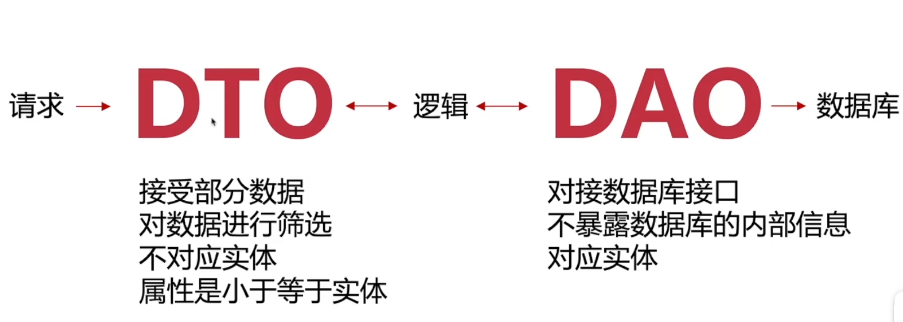

 ## docker
 1. `docker-compose up -d` 运行当前docker-compose.yml文件`-d` 后台运行，不打印运行日志
 2. `docker ps` 是一个用于查看当前正在运行的 Docker 容器的命令
 

## 编程思想(oop?fp?frp?)
 
- fp:函数式编程
- oop：面向对象编程
- aop：面向切面编程，扩展功能方便，不影响业务之间的逻辑，逻辑集中管理。利于代码复用

## IOC和DI
IOC（控制反转）

    他是一种设计模式

DI（依赖注入）

    是IOC的实现方式
 
 ```typescript
class IPhone{ 
  playGame(name:string){
    console.log(`${name}play game`);
  }
} 
class Student{
  constructor(private name:string){}

  getName() { return this.name; }
  setName(name:string) { this.namename; }
  play(){
      const iphone = new IPhone();
      iphone.playGame(this.name);
  }
} 
```
当前代码Student和IPhone有着强依赖关系，俩者需要解耦
 ```typescript
//先定义个接口
interface Phone {
  playGame:(name:string) =>void
}

class NewPhone implements Phone{ 
  playGame(name:string){
    console.log(`${name}play game`);
  }
} 
class Student{
  constructor(private name:string,private phone:Phone){}

  getName() { return this.name; }
  setName(name:string) { this.namename; }
  play(){ 
      this.phone.playGame(this.name);
  }
} 
const student = new Student('xiaoming',new NewPhone())
student.palyGame(student.getName())
```

## Nestjs 核心概念

**mvc架构** 

Controller 负责处理请求、响应请求

Service 提供方法和操作只包含业务逻辑

Data Access 负责访问数据库数据

**生命周期**

客户端 => 中间件 => 守卫 => 拦截器 => 管道 => 控制器 =>服务

 

客户端 <= 响应 <= 过滤器 <= 拦截器 <= 服务
 


## 什么是DAO? DTO?
DTO对数据进行筛选  
DAO对接数据库进行CRUD，如ORM库(typeORM、prisma)就是dao层


## 接口服务对于职责


## prisma

`npx prisma db pull` 同步模型到数据库


## 日志(winston、pino)

日志等级：
1. Log：通用日志
2. Warning:警告日志
3. Error：严重日志
4. Debug:调试日志
5. Verbose：详细日志，所有操作的详细信息

日志记录

